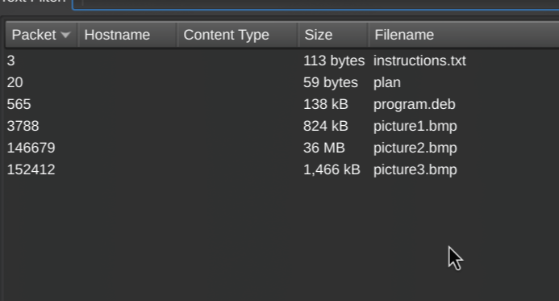

# 1. Trivial Flag Transfer Protocol

> Figure out how they moved the flag.

## Solution:

- First I downloaded the lower version of wireshark. I use arch so in the official repo's it 4.6.x and as mentioned in the group all the things can't be seen when we use this version,
- so I use dowgrade to go to the lower version i.e. 4.4.6 
- then since the major packets are of tftp I tried to extract tftp data from wireshark




in the extracted files what  we see are 2 rot13 encoded files 
1st one was instructions.txt
which after decoding said:

TFTPDOESNTENCRYPTOURTRAFFICSOWEMUSTDISGUISEOURFLAGTRANSFER.FIGUREOUTAWAYTOHIDETHEFLAGANDIWILLCHECKBACKFORTHEPLAN

as the instructions said I checked out the plan file and also decoded it with rot13 from which I get 

IUSEDTHEPROGRAMANDHIDITWITH-DUEDILIGENCE.CHECKOUTTHEPHOTOS
the `-` before duediligince gives the hint that it means something 

so we also get a deb package, which was a hassle to use since I use arch btw, so I had to install dpkg-deb to extract the contents to inspect them,
where I saw steghide as a binary, but it didnt work on arch, so I  had  to install steghide from aur repos, and used steghide on all the images using the password as DUEDILIGENCE from where the third image gave the flag  in flag.txt 
## Flag:

```
picoCTF{h1dd3n_1n_pLa1n_51GHT_18375919}
```

## Concepts learnt:

- How to Inspect Debian Packages on arch 

## Notes:

- Tried to Use online steghide tools when the included binary didn't work to decode the images, but they give giberish so had to install steghide from aur

***

# 2. tunnel_vision

> We found this file. Recover the flag.

## Solution:

I do `file tunn3l_v1s10n` but it returns just data, next I do `xxd tunn3l_v1s10n | head` i see `424d` which means this is a bmp file when I open this file in gimp I see 


sadly it just gives a fake flag, but also I notice that the upper part of the image feels cut off so I think that the image is cut off and the width is enlarged so I go to bmp image and extend its height in ghex and increse the height to match the width also i know what to change based on this image 

so I go 0x12 and 0x16 offset to match them to `6E 04`
after which I get the flag after opening the image in gimp 

## Flag:

```
picoCTF{qu1t3_a_v13w_2020}
```
## Resources:

- (https://en.wikipedia.org/wiki/List_of_file_signatures)
- (https://stackoverflow.com/questions/33483708/understanding-bmp-file)


***

# 3. m00nwalk

> Decode this message from the moon.

## Solution:

- For solving this challenge, hints were very crucuial
- The audio file seemed like giberished but when I looked at hint and searched google I saw that something interesting that it was apollo11 moonwalk was brodcasted via SSTV which was used in the audio 
then I went to an online decoder for me it was `https://sstv-decoder.mathieurenaud.fr/` and decode the image to get the flag
## Flag:

```
picoCTF{beep_boop_im_in_space}
```

## Concepts learnt:

- SSTV 
- Apollo Moon landing was interstring lmao

## Notes:

- I tried for morscode and graph but didnt work, that's when I decided for hints
***

