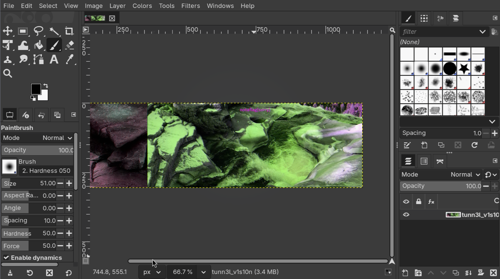
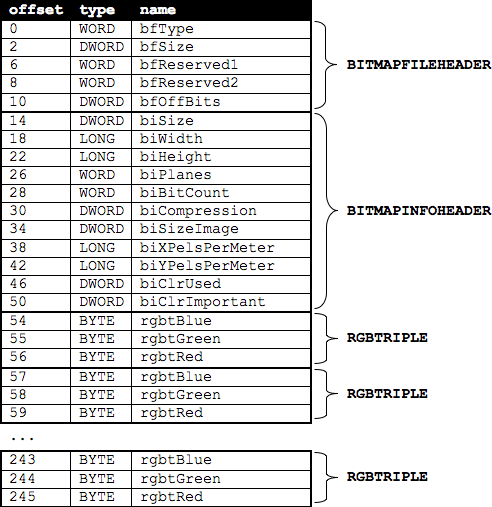
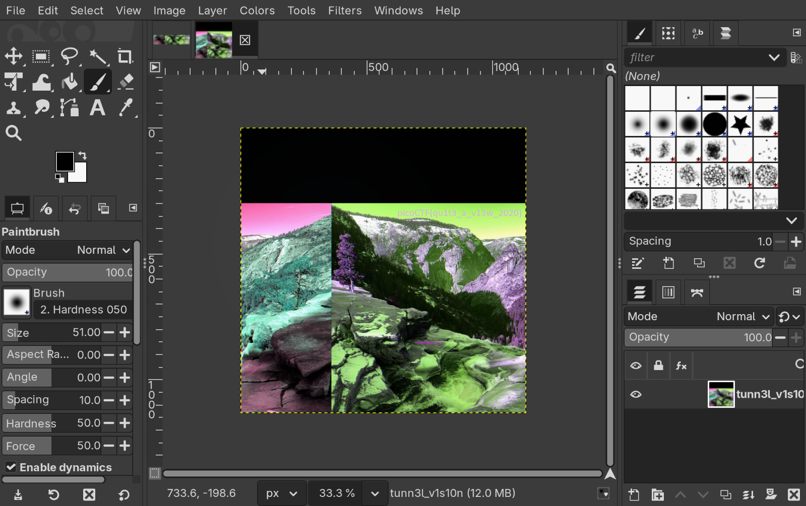

# 1. tunnel_vision

> We found this file. Recover the flag.

## Solution:

I do `file tunn3l_v1s10n` but it returns just data, next I do `xxd tunn3l_v1s10n | head` i see `424d` which means this is a bmp file when I open this file in gimp I see 


sadly it just gives a fake flag, but also I notice that the upper part of the image feels cut off so I think that the image is cut off and the width is enlarged so I go to bmp image and extend its height in ghex and increse the height to match the width also i know what to change based on this image 

so I go 0x12 and 0x16 offset to match them to `6E 04`
after which I get the flag after opening the image in gimp 

## Flag:

```
picoCTF{qu1t3_a_v13w_2020}
```
## Resources:

- (https://en.wikipedia.org/wiki/List_of_file_signatures)
- (https://stackoverflow.com/questions/33483708/understanding-bmp-file)


***

# 1. m00nwalk

> Decode this message from the moon.

## Solution:

- For solving this challenge, hints were very crucuial
- The audio file seemed like giberished but when I looked at hint and searched google I saw that something interesting that it was apollo11 moonwalk was brodcasted via SSTV which was used in the audio 
then I went to an online decoder for me it was `https://sstv-decoder.mathieurenaud.fr/` and decode the image to get the flag
## Flag:

```
picoCTF{beep_boop_im_in_space}
```

## Concepts learnt:

- SSTV 
- Apollo Moon landing was interstring lmao

## Notes:

- I tried for morscode and graph but didnt work, that's when I decided for hints
***

