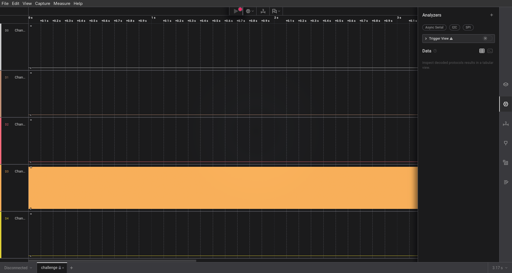

# 2. I like Logic

> i like logic and i like files, apparently, they have something in common, what should my next step be.

## Solution:

The challenge gives a sal file which when is a zip file containing bin files when those bin files are checked using  strings command they give
```
<SALEAE>
WAAF
```
when searched on google I  can download Logic2 software which is needed to open this sal file, when opening this sal file, we see various sections oone of them being analyzers, 



which, where I tried async servial first and by surprise i got it on the first tryi found data being transmitted 


i found flag in the midst of a story

## Flag:

```
FCSC{b1dee4eeadf6c4e60aeb142b0b486344e64b12b40d1046de95c89ba5e23a9925}
```

## Concepts learnt:

- i didn't know there were such signal files, would love to dig deeper 

***


# 1. bare-metal-alchmist

> my friend recommended me this anime but i think i've heard a wrong name.

## Solution:

first I did file on the elf from where I got this 
firmware.elf: ELF 32-bit LSB executable, Atmel AVR 8-bit, version 1 (SYSV), statically linked, with debug_info, not stripped

I know that AVR is generally related to arduino and stuff

since this is an executable I can open it in ghidra and decompile

decompilation gives this 
```


void main(void)

{
  char cVar1;
  byte bVar2;
  char cVar3;
  undefined2 uStack_5;
  undefined2 uStack_3;
  undefined1 uStack_1;
  
  R1 = 0;
  uStack_1 = Y._1_1_;
  uStack_3 = 0xbe;
  Y = CONCAT11((char)((uint)((int)&uStack_5 + 1) >> 8),(char)&uStack_5 + '\x01');
  R25R24._0_1_ = DAT_mem_0044;
  R25R24._0_1_ = (byte)R25R24 | 2;
  DAT_mem_0044 = (byte)R25R24;
  R25R24._0_1_ = DAT_mem_0044;
  R25R24._0_1_ = (byte)R25R24 | 1;
  DAT_mem_0044 = (byte)R25R24;
  R25R24._0_1_ = DAT_mem_0045;
  R25R24._0_1_ = (byte)R25R24 | 2;
  DAT_mem_0045 = (byte)R25R24;
  R25R24._0_1_ = DAT_mem_0045;
  R25R24._0_1_ = (byte)R25R24 | 1;
  DAT_mem_0045 = (byte)R25R24;
  R25R24._0_1_ = DAT_mem_006e;
  R25R24._0_1_ = (byte)R25R24 | 1;
  DAT_mem_006e = (byte)R25R24;
  DAT_mem_0081 = 0;
  R25R24._0_1_ = DAT_mem_0081;
  R25R24._0_1_ = (byte)R25R24 | 2;
  DAT_mem_0081 = (byte)R25R24;
  R25R24._0_1_ = DAT_mem_0081;
  R25R24._0_1_ = (byte)R25R24 | 1;
  DAT_mem_0081 = (byte)R25R24;
  R25R24._0_1_ = DAT_mem_0080;
  R25R24._0_1_ = (byte)R25R24 | 1;
  DAT_mem_0080 = (byte)R25R24;
  R25R24._0_1_ = DAT_mem_00b1;
  R25R24._0_1_ = (byte)R25R24 | 4;
  DAT_mem_00b1 = (byte)R25R24;
  R25R24._0_1_ = DAT_mem_00b0;
  R25R24._0_1_ = (byte)R25R24 | 1;
  DAT_mem_00b0 = (byte)R25R24;
  R25R24._0_1_ = DAT_mem_007a;
  R25R24._0_1_ = (byte)R25R24 | 4;
  DAT_mem_007a = (byte)R25R24;
  R25R24._0_1_ = DAT_mem_007a;
  R25R24._0_1_ = (byte)R25R24 | 2;
  DAT_mem_007a = (byte)R25R24;
  R25R24._0_1_ = DAT_mem_007a;
  R25R24._0_1_ = (byte)R25R24 | 1;
  DAT_mem_007a = (byte)R25R24;
  R25R24._0_1_ = DAT_mem_007a;
  R25R24._0_1_ = (byte)R25R24 | 0x80;
  DAT_mem_007a = (byte)R25R24;
  DAT_mem_00c1 = 0;
  R25R24._0_1_ = DAT_mem_002a;
  R25R24._0_1_ = (byte)R25R24 | 0xf8;
  DAT_mem_002a = (byte)R25R24;
  R25R24._0_1_ = DAT_mem_0024;
  R25R24._0_1_ = (byte)R25R24 | 3;
  DAT_mem_0024 = (byte)R25R24;
  bVar2 = DAT_mem_002a;
  DAT_mem_002a = bVar2 & 0xfb;
  R25R24._0_1_ = DAT_mem_002b;
  R25R24._0_1_ = (byte)R25R24 & 7;
  DAT_mem_002b = (byte)R25R24;
  R25R24._0_1_ = DAT_mem_0025;
  R25R24._0_1_ = (byte)R25R24 & 0xfc;
  DAT_mem_0025 = (byte)R25R24;
  R11 = 0xa5;
  R12 = 0;
  R13 = '\0';
  do {
    R25R24._0_1_ = DAT_mem_0029;
    R25R24._0_1_ = (byte)R25R24 ^ (byte)R25R24 * '\x02';
    if (((byte)R25R24 & 4) == 0) {
      uStack_5 = (undefined *)0x141;
      z1();
    }
    else {
      R15R14 = (byte *)0x68;
      R16 = 0;
      while( true ) {
        Z = R15R14;
        R25R24._0_1_ = *R15R14;
        if ((byte)R25R24 == 0) break;
        Z._1_1_ = (undefined1)((uint)R15R14 >> 8);
        Z._0_1_ = (byte)R25R24 ^ R11;
        if ((byte)R25R24 == 0xa5) break;
        R25R24._0_1_ = DAT_mem_0029;
        R25R24._0_1_ = (byte)R25R24 ^ (byte)R25R24 * '\x02';
        if (((byte)R25R24 & 4) == 0) {
          uStack_5 = (undefined *)0x131;
          z1();
          break;
        }
        Z._0_1_ = (byte)Z - 0x30;
        R17 = 0;
        if ((byte)Z < 0x4e) {
          Z = (byte *)CONCAT11(1,(byte)Z);
          R17 = *Z;
        }
        uStack_5 = &DAT_mem_0151;
        z1();
        if ((R17 & 1) != 0) {
          bVar2 = DAT_mem_002b;
          DAT_mem_002b = bVar2 | 8;
        }
        if ((R17 & 2) != 0) {
          bVar2 = DAT_mem_002b;
          DAT_mem_002b = bVar2 | 0x10;
        }
        if ((R17 & 4) != 0) {
          bVar2 = DAT_mem_002b;
          DAT_mem_002b = bVar2 | 0x20;
        }
        if ((R17 & 8) != 0) {
          bVar2 = DAT_mem_002b;
          DAT_mem_002b = bVar2 | 0x40;
        }
        if ((R17 & 0x10) != 0) {
          bVar2 = DAT_mem_002b;
          DAT_mem_002b = bVar2 | 0x80;
        }
        if ((R17 & 0x20) != 0) {
          bVar2 = DAT_mem_0025;
          DAT_mem_0025 = bVar2 | 1;
        }
        if ((R17 & 0x40) != 0) {
          bVar2 = DAT_mem_0025;
          DAT_mem_0025 = bVar2 | 2;
        }
        R25R24._0_1_ = R16 & 0x1f;
        cVar3 = (byte)R25R24 + 0x2d;
        while (cVar1 = cVar3 + -1, cVar3 != '\0') {
          Z = (byte *)0xf9f;
          do {
            Z = (byte *)((int)Z + -1);
            cVar3 = cVar1;
          } while (Z != (byte *)0x0);
        }
        R15R14 = (byte *)CONCAT11(R15R14._1_1_ - (((char)R15R14 != -1) + -1),(char)R15R14 + '\x01');
        R16 = R16 + 0x25;
      }
      *(byte *)(Y + 2) = R1;
      *(byte *)(Y + 1) = R1;
      while( true ) {
        R25R24._0_1_ = *(byte *)(Y + 1);
        R25R24._1_1_ = *(char *)(Y + 2);
        if (R25R24._1_1_ != '\0' && ((byte)R25R24 < 0x2c) <= (byte)(R25R24._1_1_ - 1U)) break;
        R25R24 = *(int *)(Y + 1) + 1;
        *(char *)(Y + 2) = R25R24._1_1_;
        *(byte *)(Y + 1) = (byte)R25R24;
      }
    }
    if (R12 != R1 || R13 != (byte)(R1 + (R12 < R1))) {
      uStack_5 = (undefined *)0x146;
      __vectors();
    }
  } while( true );
}

```

I know the flag is most a string so it will probably be a pointer to bytes, or characters, I still dont understand most of what is happening here and would need to take random guesses

I found this code from thsi interesting tho 


```

      while( true ) {
        Z = R15R14;
        R25R24._0_1_ = *R15R14;
        if ((byte)R25R24 == 0) break;
        Z._1_1_ = (undefined1)((uint)R15R14 >> 8);
        Z._0_1_ = (byte)R25R24 ^ R11;
        if ((byte)R25R24 == 0xa5) break;
        R25R24._0_1_ = DAT_mem_0029;
        R25R24._0_1_ = (byte)R25R24 ^ (byte)R25R24 * '\x02';
        if (((byte)R25R24 & 4) == 0) {
          uStack_5 = (undefined *)0x131;
          z1();
          break;
```
I feel like that 1st if statement is checking for `\0` in a string also i know that R15R14 is a pointer to a byte meaning it is most probs a string we are using that string and xoring with R11 which had` 0xa5;` this maybe hinting towards sth i take a look at where R15R14 was pointing

where I get this 
```

                             **************************************************************
                             * Xf                                                         *
                             **************************************************************
                             __trampolines_start                             XREF[1]:     Entry Point(*)  
                             __trampolines_end
                             _ZL2Xf
                             Xf
       code:0034 f1              db         F1h
     code:0034.1 e3              db         E3h
       code:0035 e6              db         E6h
     code:0035.1 e6              db         E6h
       code:0036 f1              db         F1h
     code:0036.1 e3              db         E3h
       code:0037 de              db         DEh
     code:0037.1 f1              db         F1h
       code:0038 cd              db         CDh
     code:0038.1 94              db         94h
       code:0039 d6              db         D6h
     code:0039.1 fa              db         FAh
       code:003a 94              db         94h
     code:003a.1 d6              db         D6h
       code:003b fa              db         FAh
     code:003b.1 d6              db         D6h
       code:003c ca              db         CAh
     code:003c.1 c8              db         C8h
       code:003d 96              db         96h
     code:003d.1 fa              db         FAh
       code:003e d6              db         D6h
     code:003e.1 94              db         94h
       code:003f c8              db         C8h
     code:003f.1 d5              db         D5h
       code:0040 c9              db         C9h
     code:0040.1 96              db         96h
       code:0041 fa              db         FAh
     code:0041.1 91              db         91h
       code:0042 d7              db         D7h
     code:0042.1 c1              db         C1h
       code:0043 d0              db         D0h
     code:0043.1 94              db         94h
       code:0044 cb              db         CBh
     code:0044.1 ca              db         CAh
       code:0045 fa              db         FAh
     code:0045.1 c3              db         C3h
       code:0046 94              db         94h
     code:0046.1 d7              db         D7h
       code:0047 c8              db         C8h
     code:0047.1 d2              db         D2h
       code:0048 91              db         91h
     code:0048.1 d7              db         D7h
       code:0049 c0              db         C0h
     code:0049.1 d8              db         D8h
       code:004a 00              db         0h
     code:004a.1 00              db         0h
```

i extract the bytes because and do XOR on them because of this 

```

        Z._0_1_ = (byte)R25R24 ^ R11;
        if ((byte)R25R24 == 0xa5) break;
```
its checking if byte is 0xa5 which will \0 be after being xored with 0xa5 and r11 also points 0xa5
 I xor it and convert to ascci which resulted in the flag. I still don't understnad how I did this this was very new to me Will explore in future for sure

## Flag:

```
TFCCTF{Th1s_1s_som3_s1mpl3_4rdu1no_f1rmw4re}
```

## Concepts learnt:

- arduino code 
- some more genereal things

## Resources:

[this article](https://www.jonaslieb.de/blog/arduino-ghidra-intro/)
and some general things on google, which I understood using llms


***
