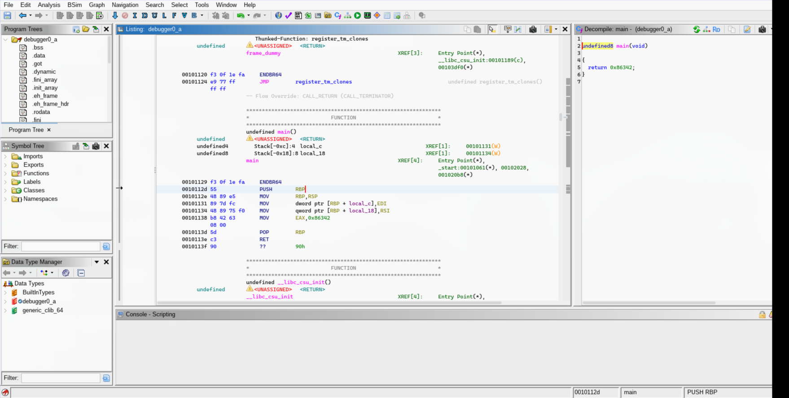

# 1. GDB Baby Step 1

>  Can you figure out what is in the eax register at the end of the main function? Put your answer in the picoCTF flag format: picoCTF{n} where n is the contents of the eax register in the decimal number base. If the answer was 0x11 your flag would be picoCTF{17}.

## Solution:

- The question itself gives us the hint on what to do, and where to find the value, we find the value in the eax register, so we just have to look at the values moved into that register




## Flag:

```
picoCTF{549698}
```
## Alternate Method

We can do this as the question intended via gdb we can break at main and then do stepi until the value in the rax register changes

```
(gdb) break main
Breakpoint 1 at 0x1131
(gdb) run 
Starting program: /home/clutch/programming/cryptonite/programs/debugger0_a 
[Thread debugging using libthread_db enabled]
Using host libthread_db library "/usr/lib/libthread_db.so.1".

Breakpoint 1, 0x0000555555555131 in main ()
(gdb) info register rax
rax            0x7ffff7e10e28      140737352109608
```

we do this 3 times until the value changes
```
(gdb) stepi
0x000055555555513d in main ()
(gdb) info register rax
rax            0x86342             549698
(gdb) 
```
or we can also just disassemble main using gdb
```
Dump of assembler code for function main:
   0x0000555555555129 <+0>:	endbr64
   0x000055555555512d <+4>:	push   %rbp
   0x000055555555512e <+5>:	mov    %rsp,%rbp
   0x0000555555555131 <+8>:	mov    %edi,-0x4(%rbp)
=> 0x0000555555555134 <+11>:	mov    %rsi,-0x10(%rbp)
   0x0000555555555138 <+15>:	mov    $0x86342,%eax
   0x000055555555513d <+20>:	pop    %rbp
   0x000055555555513e <+21>:	ret
End of assembler dump.
```

Here we see the `mov $0x86342, %eax` which moves the value to eax and that must be our ans
## Concepts Learnt
 - gdb basics

***

# 2. ArmAssembly 1 

> For what argument does this program print `win` with variables 81, 0 and 3? File: chall_1.S Flag format: picoCTF{XXXXXXXX} -> (hex, lowercase, no 0x, and 32 bits. ex. 5614267 would be picoCTF{0055aabb})

## Solution:

1. We open the arm file in an text editor.

```asm
func:
	sub	sp, sp, #32
	str	w0, [sp, 12]
	mov	w0, 81
	str	w0, [sp, 16]
	str	wzr, [sp, 20]
	mov	w0, 3
	str	w0, [sp, 24]
	ldr	w0, [sp, 20]
	ldr	w1, [sp, 16]
	lsl	w0, w1, w0
	str	w0, [sp, 28]
	ldr	w1, [sp, 28]
	ldr	w0, [sp, 24]
	sdiv	w0, w1, w0
	str	w0, [sp, 28]
	ldr	w1, [sp, 28]
	ldr	w0, [sp, 12]
	sub	w0, w1, w0
	str	w0, [sp, 28]
	ldr	w0, [sp, 28]
	add	sp, sp, 32
    ret 
```
In this we see that:
1. 32 bytes are reserved on the stack pointer
2. We store the value in the w0 register to 12th offset in the stack  // store the input arg in sp[12]
3. We move 81 to w0 register 
4. We store w0 to the 16th offset of the stack meaning we store 81 to 16th offset 
5. We store zero to 20th offset
6. move 3 to w0 
7. move w0(3) to 24th offset 
8. We load the value on 20th offset to w0
9. We load the value on 16th offset to w1
10. We left shift the value on w1 by value on w0 and store it in w0 which is 81 << 0
11. store the result of the shift on 28th offset  stack[28] = 81
12. load the value on 28th offset to w1 register w1 = 81
13. load the value on 24th offset to w0 register  w0 = 3
14. then divide w1 by w0 and store it in w0  since it is sdiv (signed
    integer division) we truncate the decimal w0 becomes 27
15. store that value on 28th offset 
16. laod that on w1 register 
17. load what was in the 12th register to w0 
18. store what was on w0 to 28th 
19. immediately load it again to w0 for some reason 
20. then we sub w1 by w0 and store result in w0. w0 = 27-w0 
21. Store w0 to 28th offset 
20. then free the stack and return from the function 

so we know 27-input = 0 is checked for success, so the input should we 27 to get the result 
so 


## Flag:

```
picoCTF{0000001B}
```

## Concepts learnt:

Basics for Arm asembly

## Notes:

- I still dont fully understnad what's happening the main function, would need to study more about stack frames and such.
  Resources:
- [Anu School of Computing Arm Cheatsheet](https://comp.anu.edu.au/courses/comp2300/resources/03-ARM-cheat-sheet/)

# 3. vault-door-3

> This vault uses for-loops and byte arrays. The source code for this vault is here: VaultDoor3.java

## Solution:

We are given some java code which basically obfuscates the real password and we are given the obfuscated password which is "jU5t_a_sna_3lpm18gb41_u_4_mfr340" we can create a python script that reverses the operations performed in java code to get the real password for the vault. Here's the script that I wrote for the same.
```py
a = "jU5t_a_sna_3lpm18gb41_u_4_mfr340"
b = ["0"]*32
for x in range(17,32,2):
    b[x] = a[x]
for x in range(16,32,2):
    b[x] = a[46-x]
for x in range(8,16,1):
    b[x] = a[23-x]
for x in range(0,8):
    b[x] = a[x]

print("".join(b))
```

## Flag:

```
picoCTF{jU5t_a_s1mpl3_an4gr4m_4_u_1fb380}
```

